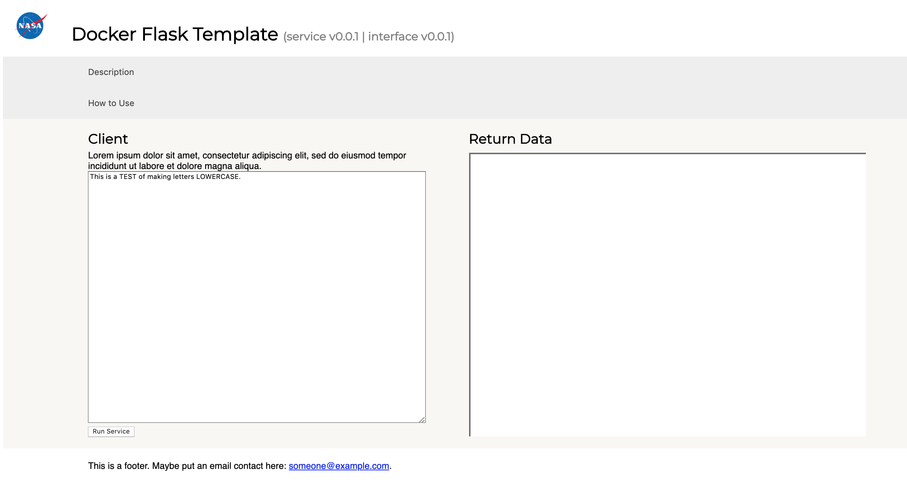

# Docker Flask Template

This is an opinionated template for dockerized flask apps which can run behind an nginx reverse proxy. If you want to run flask in docker behind a reverse proxy, this template could save you many pathing headaches. There are many docker concepts which are will aid with understanding this template.

The front end looks like this:


# Installation

1) Clone this repository.  
2) Change directory to the docker-flask-template.
    ```bash
    cd docker-flask-template
    ```
3) Build the flask docker image.
    ```bash
    docker build -t flask:example .
    ```  
4) Use the image to instantiate a container.
    ```bash
    docker run -it --name flask_test -p 5001:5000 flask:example
    ```
    \* the 5001 can be change for your configuration, but the second number, 5000, is specific to the container's image and, therefore, must remain as 5000.
     
    You should now be able to point to localhost:5001 with your browser and see the template landing page there. Now we have a functioning flask app which accesses static resources. There are default endpoints at `localhost:5001/hello` and `localhost:5001/blurgh/`.

## editing the template

1) Edit the api by changing [app.py](app.py).
2) Change frontend by editing the [Jinja2 template](templates/home.html).


## optional: reverse proxy
    
5) Now we want to run the flask app behind a reverse proxy. Oftentimes, this reverse proxy will already be established for you. If this is the case, you may skip this step and simply ask your system administator to the tie your flask service into their reverse proxy. Otherwise, continue.
 
   While your flask service is running, start the reverse proxy with:
   ```bash
    docker run -d -p 80:80 -v $(pwd)/nginx:/etc/nginx --link flask_test:flask_test  nginx
   ``` 
   The "--link" parameter here makes is so the reverse proxy can communicate with the flask server container. In particular it allows us to reference the container IP by using its name "flask_test" on line 60 in [this configuration file](/nginx/conf.d/default.conf).
   
   If we nginx to communicate with flask running on a remote server, we can will need to use the commented lines 45 to 56 in the same file. substituting <your machine private ip> with the IP of the machine on which the flask server is running.
   \* links may soon be deprecate in favor of using [user defined networks](https://docs.docker.com/network/bridge/#manage-a-user-defined-bridge).
   
   You should now be able to point your url to localhost/linked_with_docker to see the service as well. You can point to localhost/linked_with_docker/hello to see the other flask page. 
   
   If you use the remote IP option (which could also just be your local IP address), you will be able to access the service through localhost/test .
   
6) Tailor for your own use! 
